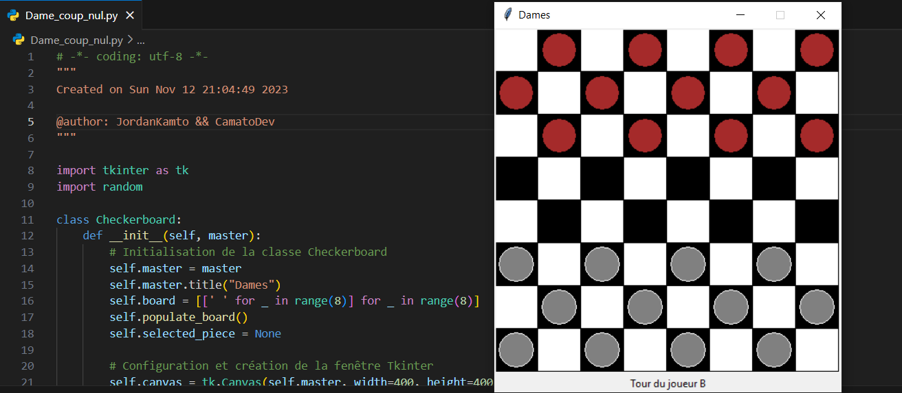

# Jeu de Dames avec Intelligence Artificielle

## 📌 Description
Ce projet est un **jeu de dames** en Python avec interface Tkinter. Il intègre deux intelligences artificielles :  
- une basée sur l’algorithme **NegaMax**  
- une basée sur la stratégie du **"coup nul"**

## 🚀 Fonctionnalités
- Plateau interactif avec Tkinter
- Joueur contre joueur ou contre IA
- Analyse et prévision des coups en temps réel

## 🛠 Technologies
- Python
- Tkinter

## 📸 Apercu
